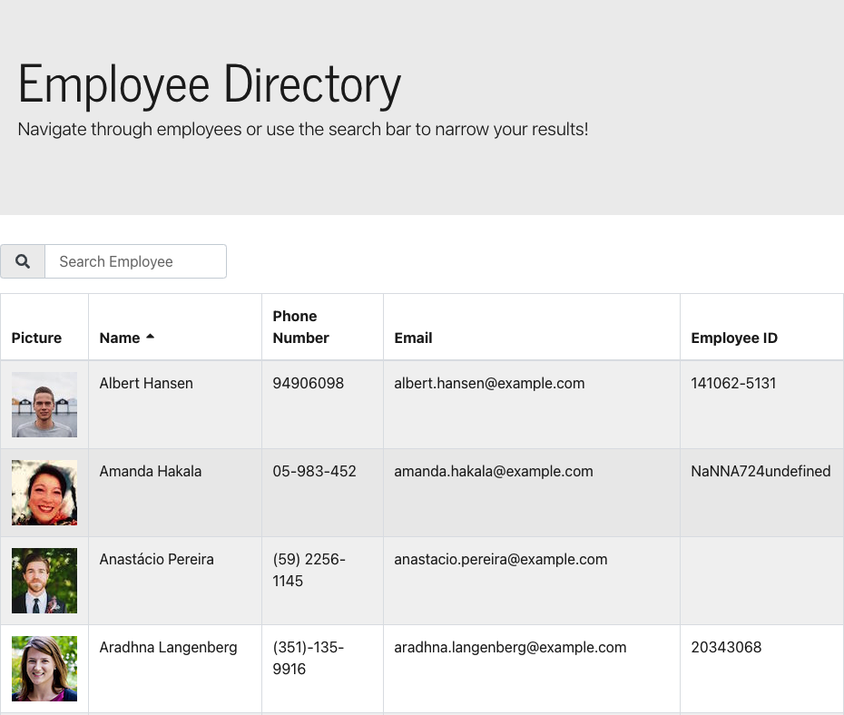
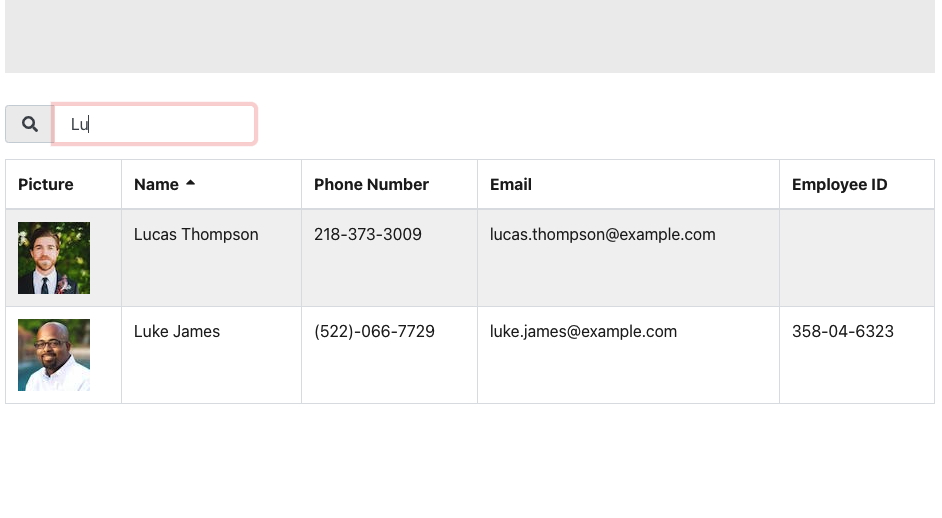

# **react-employee-directory (“Employee Directory”)**

## Table of Contents

* [Description](#description)
* [Requirements](#requirements)
* [Installation](#installation)
* [Contributing](#contributing)
* [Credits](#credits)

## Description
---
React application that fetches random user information from an API to create employees. Those employees are then displayed in a table, which can be sorted alphabetically by name as well as filtered by names through the search bar.

Deployed Website: https://haleighspurlock.github.io/react-employee-directory/




## Requirements 
---
```
As a user, I want to be able to view my entire employee directory at once so that I have quick access to their information.

-Acceptance Criteria-
Given a table of random users generated from the Random User API, when the user loads the page, a table of employees should render.

The user should be able to:
*Sort the table by at least one category
*Filter the users by at least one property.
```

## Installation
---

See deployed site here: https://haleighspurlock.github.io/react-employee-directory/

See repository here: https://github.com/haleighspurlock/react-employee-directory
## Contributing
---

Any and all improvement suggestions are welcome! 


## Credits
---
Haleigh Spurlock &COPY; 2021